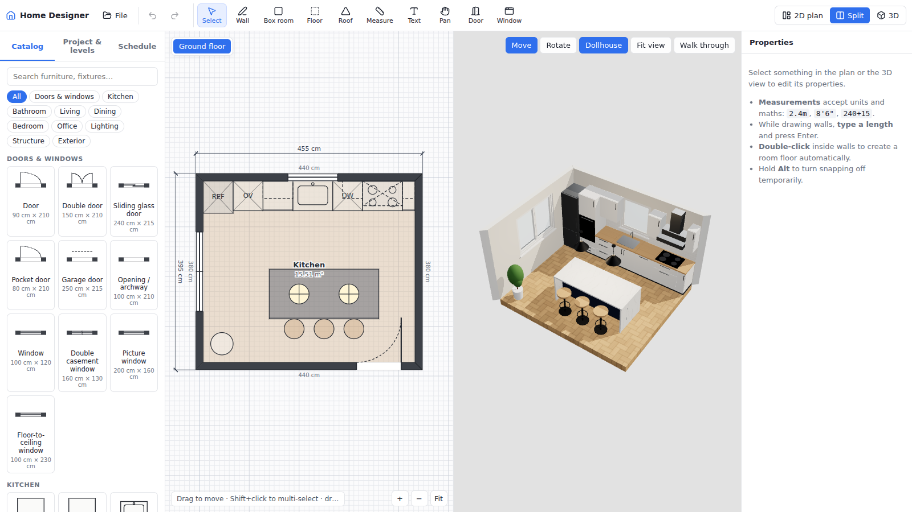
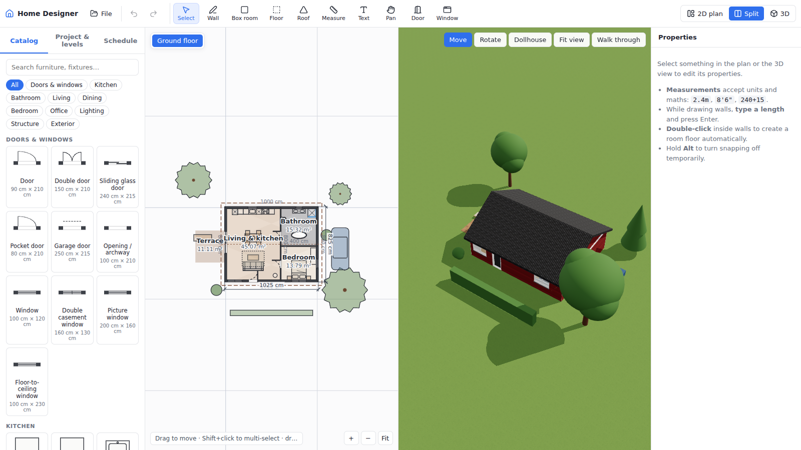
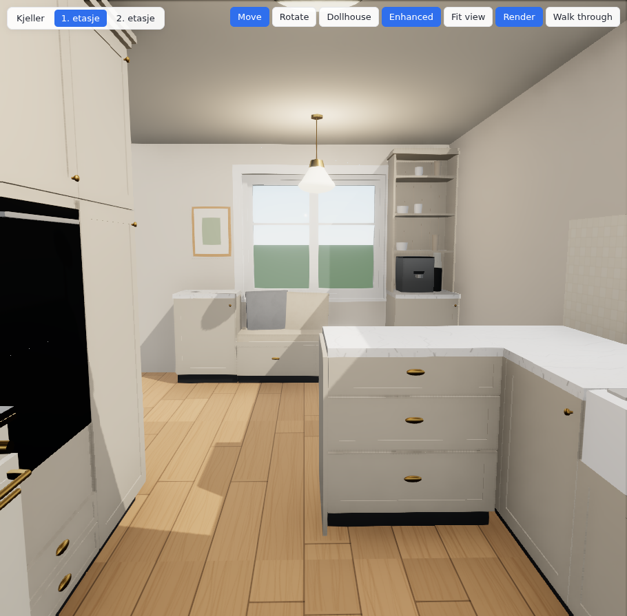
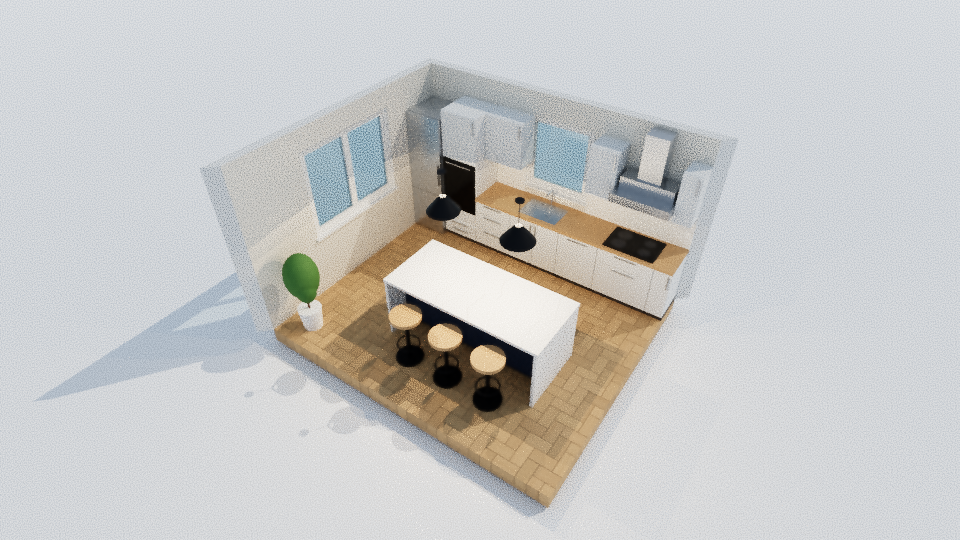

# Home Designer

A browser-based interior and exterior design tool for planning kitchens, bathrooms and whole houses. You draw the floor plan in 2D, with exact measurements, and see it rendered live in 3D.

It runs fully locally: no account, no server. Projects are autosaved in the browser and can be saved/opened as `.home.json` files.







## Features

**Floor plan (2D)**
- Walls: click-to-draw chains with snapping to end points, walls, 15° angles, alignment guides and the grid. **Type an exact length while drawing** (`420`, `4.2m`, `13'9"`, `300+120`) and press Enter.
- Wall corners are mitred automatically. T-junctions and crossings are supported. Walls can have a sloped top (e.g. knee walls under a slanted roof) and a separate finish on each side.
- **Box room** tool: drag a rectangle to get four walls and a floor in one go.
- **Floor** tool: draw a floor polygon, or **double-click inside walls** to detect the room automatically. Rooms show name, area and perimeter.
- Doors (single, double, sliding, pocket, garage, archway) and windows (casement, double, picture, floor-to-ceiling). They attach to walls, slide along them, and doors swing towards the side you insert them from.
- Dimension lines, automatic wall lengths, text labels.
- Select, multi-select (Shift / box select), move, rotate and resize handles. Live clearances show the distance from the selected object to the surrounding walls.
- Magnetic furniture: cabinets and fixtures snap their back against walls and line up with each other and with perpendicular walls. This is ideal for kitchen runs.
- Multiple levels, with the level below shown faintly for reference. "Add level (copy)" duplicates walls, rooms and windows upstairs.

**Roofs**
- Flat, shed/mono-pitch (slanted), gable, hip (becomes a pyramid on square plans), gambrel (barn) and mansard.
- Pitch, overhang, eave height, thickness, rotation and ridge direction. Optional gable-end infill walls.
- Readouts for ridge height and sloped roof area. Click the roof tool once to cover all walls automatically.

**3D view**
- Live 3D model with sun and sky, soft shadows, reflections and a procedural material library: wood floors, herringbone, tiles, marble, terrazzo, brick, wood cladding, render, roof tiles, slate, standing seam, grass and more. You can also pick any custom colour.
- Around 70 parametric objects:
  - Kitchen: base, drawer, sink, cooktop and corner units, wall and tall units, oven tower, fridge, range, hood, island, worktop, backsplash, stools, farmhouse sink, classic range cooker, painted mantel hood, hutch with open shelves, pot rail, espresso machine
  - Cabinets and furniture can have flat or **shaker** fronts, with handles and taps in steel, brass, black and other metals
  - Bathroom: toilets, vanities, basins, built-in and freestanding tubs, shower enclosure, walk-in screen, mirror cabinet, towel radiator, washing machine
  - Living, dining, bedroom, office and lighting furniture, with lamps that emit light
  - Structure: stairs, columns, beams, slabs, generic box/cylinder, radiators
  - Exterior: trees, conifers, shrubs, hedges, fences, decks, pergola, pool, sun loungers, car
- Click objects in 3D to select them. Move or rotate them with the gizmo, including height.
- **Dollhouse** mode hides the walls facing the camera, so you can look into rooms. **Cutaway** lowers the walls on the current level.
- **Walk-through** first-person mode (WASD + mouse).

**Output**
- Schedule / bill of quantities: rooms with areas, doors & windows, furniture grouped by type with sizes and finishes. Exports to CSV.
- Export the 3D render as PNG, the 3D model as **GLB** (Blender, Unreal, Twinmotion…) or **COLLADA .dae** for SketchUp, the floor plan as **SVG**, or **print** the plan / save it as PDF. Model exports always contain the whole building and garden, whatever the current view shows.
  - **SketchUp:** File → Import → COLLADA (*.dae). The model comes in at real size (metres), with each piece of furniture as its own group named after it, and one material per finish. Materials are flat colours; the wood, tile and brick patterns are not included (use GLB in Blender for textures).
- Units: millimetres, centimetres, metres, inches or feet-and-inches. Every measurement field accepts units and arithmetic.

## Realistic rendering

There are two quality levels inside the app:

1. **Live view, Enhanced** (on by default; toggle in the 3D toolbar). Adds screen-space ambient occlusion (N8AO), which darkens corners and contact points, plus a soft glow on lamps, filmic tone mapping and anti-aliasing.
2. **Render** (3D toolbar or File → Photorealistic render…). A GPU **path tracer** ([three-gpu-pathtracer](https://github.com/gkjohnson/three-gpu-pathtracer)) re-renders the current camera view with:
   - global illumination (light bouncing between surfaces)
   - sky light through windows
   - glowing lamp shades that light the room
   - real reflections and glass transmission
   - optional denoising

   Pick a resolution (up to 2560×1440, square or portrait) and a quality (32 to 2000 samples). The image sharpens as samples accumulate. Stop at any time and save the PNG. On a modern GPU, a Full HD render at "Good" takes seconds to a minute or two.



*Kitchen template rendered in-app with the path tracer (draft quality, 32 samples). Higher sample counts remove the grain.*

For the last step to magazine-grade images, export **GLB** to Blender (Cycles) or D5 Render, or **DAE** to SketchUp and render with V-Ray or Enscape.

### Post-production, AI enhancement and video

| Goal | Tools | Notes |
| --- | --- | --- |
| Make a render photographic (textures, lighting, props) | AI render enhancers such as Rendair, MyArchitectAI, Vibe3D, ArchiVinci | Upload the PNG from *Render*. Great for mood images. AI can subtly change geometry, so keep the plan/SVG as the source of truth for dimensions. |
| Turn stills into walkthrough clips | **Higgsfield** (image-to-video with camera moves; bundles Kling, Veo, Sora and other models) or Redraw | Feed one render per room, pick a slow dolly or orbit move, then join the clips. Credit-based pricing. |
| Compositing / motion graphics (After Effects alternatives) | **DaVinci Resolve + Fusion** (free), **Blender** compositor & video editor (open source), **Natron** (open-source node compositor), Friction (open-source motion graphics, young) | Resolve is the best free all-rounder for editing, colour grading and titles. |

## Getting started

```sh
git clone https://github.com/aadnesd/architecting.git
cd architecting
npm install
npm run dev        # http://localhost:5173
```

Other scripts: `npm run build` (type-check and production build into `dist/`, which you can host on any static server), `npm run preview`, `npm test` (unit tests for geometry, units, room detection and roofs).

The first launch opens a sample house. Use **File → New from template** for the kitchen, bathroom, house or an empty project.

## Hosting

The app is a static site: `npm run build` writes everything to `dist/`, which any static host can serve (all paths are relative).

- **GitHub Pages:** the workflow `.github/workflows/pages.yml` builds, tests and deploys the app on every push to `main`. To turn it on once: repository **Settings → Pages → Source: GitHub Actions**. The site is then at https://aadnesd.github.io/architecting/.
- **Netlify / Cloudflare Pages / Vercel:** build command `npm run build`, output directory `dist`. These work with private repositories on their free plans.

## Keyboard shortcuts

| Key | Action |
| --- | --- |
| `V` `W` `B` `F` `T` `M` `X` `H` | Select, Wall, Box room, Floor, Roof, Measure, Text, Pan |
| `D` / `N` | Insert door / window |
| `R` / `Shift+R` | Rotate selected object (or the object being placed) 90° / 15° |
| Arrows / `Shift`+Arrows | Nudge selection 1 cm / 10 cm |
| `Ctrl+Z`, `Ctrl+Shift+Z` / `Ctrl+Y` | Undo, redo |
| `Ctrl+C`, `Ctrl+V`, `Ctrl+D` | Copy, paste, duplicate |
| `Delete` | Delete selection |
| `Esc` | Finish / cancel the current tool |
| `Alt` (hold) | Temporarily disable snapping |
| Wheel, middle-drag or `Space`+drag | Zoom, pan |

## Why a custom tool? Open-source alternatives considered

| Tool | Strengths | Why it wasn't enough on its own |
| --- | --- | --- |
| [Sweet Home 3D](https://www.sweethome3d.com/) (GPL, Java) | The closest match: 2D plan + 3D, furniture catalog, photo renderer | Roofs are not a first-class feature (no roof tool, only work-arounds or plugins). Dated UI. Requires Java on the desktop. |
| [FreeCAD](https://www.freecad.org/) BIM workbench | Real BIM, IFC, precise drafting, roofs | Steep learning curve. Slow for quick kitchen/bathroom layout and furnishing. |
| [Blender](https://www.blender.org/) + [Bonsai](https://bonsaibim.org/) (ex BlenderBIM) | Best rendering, IFC | A general 3D suite. No quick floor-plan workflow or furniture catalog for this job. |
| LibreCAD / QCAD | Excellent 2D drafting | No 3D at all. |
| Blueprint3D, react-planner (web) | Browser-based floor planners | Unmaintained for years. No roofs, levels, schedules or modern rendering. |

Home Designer covers the day-to-day planning loop in one place: plan, measure, furnish, choose materials, add roofs, view in 3D and export quantities. It works together with the tools above rather than replacing them. Export **GLB** to get photorealistic renders in Blender, or **SVG** to import the plan into CAD.

## Project structure

```
src/
  model/      data model (types), catalog, materials, templates, factories
  geometry/   pure maths: walls & mitres, roofs, room detection, units parser (unit-tested)
  store/      zustand store with undo/redo history and autosave
  plan/       SVG 2D editor: tools, snapping, symbols, dimensions
  three/      react-three-fiber 3D view: wall CSG, roofs, procedural furniture, textures
  ui/         toolbar, catalog, properties, project/levels, schedule panels
  io/         file open/save and exports
```

Stack: React 19, TypeScript, Vite, three.js with @react-three/fiber and drei, three-bvh-csg for cutting openings, and zustand + immer for state.

## Known limitations / next steps

- Walls are not trimmed to roofs automatically. Use sloped walls (height at start / end) or the roof's gable infill.
- Floors are not cut for stairwells yet.
- No DXF/IFC import. Plans can't be traced from an image yet.
- Textures are procedural (no photo-scanned materials yet), and furniture is built from simple shapes, which limits how photographic even path-traced renders get.
